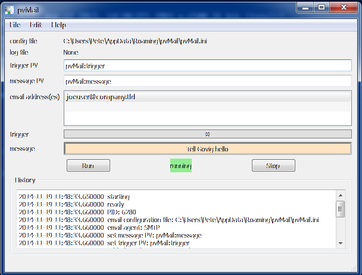

.. _GUI:

pvMail: graphical user interface
################################

.. index:: example

The PvMail program GUI is started from the command line with the ``-g`` 
or ``--gui`` command-line options.  
If either GUI option is used, then the positional arguments 
(``triggerPV messagePV email@address``) are optional.
Without either GUI option, the
command-line interface is started.::

	$ pvMail -g &

.. tip::
   Usually, you want to run the GUI as a background task by appending
   the ampersand (``&``) on the command line, as shown above.

   
   GUI of the *PvMail* application

The GUI provides editable text entry widgets for each of the required 
command-line terms (a.k.a. *positional arguments*): 
``trigger_PV message_PV email_addresses``.
The list of email addresses is separated.  The GUI provides a tool
to add additional address or remove addresses.

.. warning::
   At present, the GUI provides few visual cues 
   about the success of PV connections or even 
   that the program is working.  
   Check the status log for clues.
   This will be fixed in a future version.

The GUI also shows (using *running* or *stopped* text) whether or not
the PV monitor process is running.

.. warning::
   If either of the PVs fails to connect, it is likely that the GUI may
   become confused whether or not it is running.  In such cases, press
   the *Stop* button, then press the *Run* button to try to restart monitoring.

All PvMail monitoring will be stopped if the GUI window is closed.
At present, there is no feature to detach or reattach a monitor set.
Also, PvMail can only monitor a single set of PVs using the current design.
A request to enhance this capability is on the TODO list (see :ref:`TODO`).

At the bottom of the GUI panel, a status line is shown.  At present, this 
does not indicate the status of the monitoring process.  Again,
this will be fixed soon.

Send test email
***************

Under the *File* menu, there is an item to ``send test email`` which attenpts
to send a test email using the current settings as described in the configuration
file.
